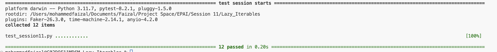

# Polygon and Polygon Sequence Implementation (Session 11)

## Polygon Sequence with Iterator and Lazy Evaluation

### Polygon Sequence Class with Iterator

The `PolygonSequence` class has been enhanced to include an iterator for traversing through the sequence of polygons. This allows you to use the `PolygonSequence` object in a `for` loop or other contexts that require an iterable.

#### Iterator Implementation

The `PolygonSequence` class now includes an internal iterator class, `SequenceIter`, that enables iteration over the polygons in the sequence.

### Lazy Evaluation in Polygon Properties

Lazy evaluation is used to ensure that property calculations are performed only when needed and are cached for subsequent accesses. This optimizes performance by avoiding redundant calculations.

#### Updated Code with Lazy Evaluation and Iterator

```python
from convex_polygon import Polygon

class PolygonSequence:
    """
    A class to represent a sequence of convex polygons with a common circumradius.
    """

    def __init__(self, max_edges: int, circumradius: float) -> None:
        """
        Initializes a PolygonSequence with the maximum number of edges and a common circumradius.

        Parameters:
        max_edges : int
            The number of edges in the largest polygon in the sequence.
        circumradius : float
            The circumradius common to all polygons in the sequence.
        """
        if max_edges < 3:
            raise ValueError("A sequence must have at least 3 edges.")
        self.max_edges = max_edges
        self.circumradius = circumradius

    def __len__(self) -> int:
        """
        Returns the number of polygons in the sequence.
        """
        return self.max_edges - 2

    def __getitem__(self, s):
        """
        Returns a polygon or a list of polygons from the sequence.
        """
        if isinstance(s, int):
            s = s + 3
            if s < 3 or s > self.max_edges:
                raise IndexError("Index out of range.")
            return Polygon(s, self.circumradius)
        else:
            indices = range(*s.indices(self.max_edges - 2))
            return [Polygon(i + 3, self.circumradius) for i in indices]

    @property
    def max_efficiency_polygon(self) -> Polygon:
        """
        Returns the polygon with the highest area-to-perimeter ratio in the sequence.
        """
        return max(self, key=lambda p: p.area / p.perimeter)

    def __repr__(self) -> str:
        """
        Returns a string representation of the PolygonSequence object.
        """
        return f"PolygonSequence(max_edges={self.max_edges}, circumradius={self.circumradius})"
    
    def __iter__(self):
        """
        Returns an iterator object for the sequence.
        """
        return self.SequenceIter(self)
    
    class SequenceIter:
        """
        Iterator class for the PolygonSequence.
        """
        def __init__(self, poly_obj):
            """
            Initializes the iterator.
            """
            self._poly_obj = poly_obj
            self._index = 0

        def __iter__(self):
            """
            Returns the iterator instance.
            """
            return self

        def __next__(self):
            """
            Returns the next polygon in the sequence.
            """
            if self._index >= len(self._poly_obj):
                raise StopIteration
            else:
                poly_item = Polygon(self._index + 3, self._poly_obj.circumradius)
                self._index += 1
                return poly_item
```

### Usage

You can iterate over the `PolygonSequence` object to access each `Polygon` instance sequentially.

Example:
```python
from polygon_sequence import PolygonSequence

polygons = PolygonSequence(10, 5)

# Iterating over the PolygonSequence
for polygon in polygons:
    print(polygon)
```

Output:
```python
Polygon(n=3, R=5)
Polygon(n=4, R=5)
Polygon(n=5, R=5)
Polygon(n=6, R=5)
Polygon(n=7, R=5)
Polygon(n=8, R=5)
Polygon(n=9, R=5)
Polygon(n=10, R=5)
```

### Tests

I have run pytest on the Sequence Iterator Module and below is the pytest results in local. You can check GitHub Actions too for pytest results.



#### Test 1: Iteration Over PolygonSequence

Tests the basic iteration over `PolygonSequence` using a `for` loop.

```python
def test_polygon_sequence_iteration():
    """Test iteration over PolygonSequence using a for loop."""
    polygons = PolygonSequence(10, 5)

    print("Testing for loop iteration:")
    for polygon in polygons:
        print(f"Polygon with {polygon.count_edges} edges: Area = {round(polygon.area,2)}, Perimeter = {round(polygon.perimeter,2)}")
```

#### Test 2: Using `next()` with Iterator

Tests the `next()` function with an iterator created from `PolygonSequence`.

```python
def test_polygon_sequence_next():
    """Test next() and iter() for PolygonSequence."""
    polygons = PolygonSequence(10, 5)

    print("\nTesting next() with iter():")
    polygon_iter = iter(polygons)
    first_polygon = next(polygon_iter)
    assert first_polygon.count_edges == 3, f"Expected 3 edges, got {first_polygon.count_edges}"
    print(f"First polygon using next(): {first_polygon.count_edges} edges")
```

#### Test 3: Exhausting the Iterator

Tests that the iterator can be exhausted properly.

```python
def test_polygon_sequence_exhaust_iterator():
    """Test exhausting the PolygonSequence iterator."""
    polygons = PolygonSequence(10, 5)

    print("\nExhausting the iterator:")
    polygon_iter = iter(polygons)
    try:
        while True:
            polygon = next(polygon_iter)
            print(f"Polygon with {polygon.count_edges} edges")
    except StopIteration:
        print("Iterator has been exhausted.")
```

#### Test 4: Resetting the Iterator

Tests creating a new iterator instance and iterating again.

```python
def test_polygon_sequence_reset_iterator():
    """Test creating a new iterator instance for PolygonSequence."""
    polygons = PolygonSequence(10, 5)

    print("\nCreating a new iterator and iterating again:")
    new_iter = iter(polygons)
    for polygon in new_iter:
        print(f"Polygon with {polygon.count_edges} edges: Area = {round(polygon.area,2)}, Perimeter = {round(polygon.perimeter,2)}")
```

#### Test 5: Using an Exhausted Iterator

Tests using an exhausted iterator to ensure it raises `StopIteration` when accessed again.

```python
def test_polygon_sequence_exhausted_iterator():
    """Test using an exhausted iterator for PolygonSequence."""
    polygons = PolygonSequence(10, 5)

    print("\nTesting the exhausted iterator:")
    polygon_iter = iter(polygons)
    try:
        while True:
            next(polygon_iter)
    except StopIteration:
        print("Iterator has been exhausted.")

    try:
        next(polygon_iter)  # This should raise StopIteration immediately
    except StopIteration:
        print("Cannot iterate; the iterator is exhausted.")
```

#### Test 6: Maximum Efficiency Polygon

Tests finding the polygon with the highest area-to-perimeter ratio.

```python
def test_polygon_sequence_max_efficiency():
    """Test finding the maximum efficiency polygon in PolygonSequence."""
    polygons = PolygonSequence(10, 5)

    max_efficiency_polygon = polygons.max_efficiency_polygon
    assert isinstance(max_efficiency_polygon, Polygon), "Expected a Polygon instance"
    print(f"Max efficiency polygon has {max_efficiency_polygon.count_edges} edges.")
```

